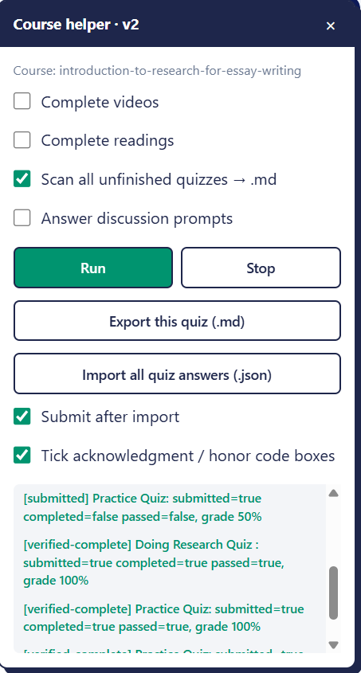

<div align="center">

# Course Helper

**A Chrome extension that takes the busywork out of Coursera courses.**

Complete videos and readings, answer discussion prompts, and move quiz questions in and out of an AI assistant with Markdown and JSON.


[Features](#features) · [Installation](#installation) · [Usage](#usage) · [Disclaimer](#disclaimer) · [Support](#support)

</div>

---

## What is this?

Course Helper adds a small floating panel to any `coursera.org/learn/...` page. From that panel you can finish the repetitive parts of a course in a few clicks, and turn quizzes into a copy-paste workflow with your favourite AI chat.

<p align="center">
  
</p>

It is plain JavaScript with no dependencies and no build step. Download it, load it, use it.

## Features

| | Feature | What it does |
|---|---|---|
| ▶️ | **Complete videos** | Marks every video item in the current course as done. |
| 📖 | **Complete readings** | Marks every reading item in the current course as done. |
| 💬 | **Answer discussion prompts** | Shows each prompt, lets you type an answer, and posts it. You can skip any prompt. |
| 📝 | **Export questions (.md)** | Saves the quiz questions as a Markdown file and copies them to your clipboard, together with instructions and a JSON answer template for an AI assistant. |
| 📥 | **Import all quiz answers (.json)** | Opens every eligible quiz in one work tab and fills it from the `answer.json` your assistant returns. Graded quizzes, choices and text responses are supported. |
| ✅ | **Submit after import** | Optionally submits the quiz right after the answers are filled. |
| ☑️ | **Honor code helper** | Optionally ticks the honor code box for you. |

## Installation

Course Helper is not on the Chrome Web Store, so you load it as an unpacked extension.

### Download the latest release

1. Open the [latest release](https://github.com/Astramyth/coursera-helper/releases/latest).
2. Under **Assets**, download **Source code (zip)**.
3. Unzip it to a folder you will keep. Chrome reads the extension from that folder, so do not delete or move it afterwards.

> Install from a release only. The code on the `main` branch is work in progress and may be broken.

### Load the extension in Chrome

1. Open `chrome://extensions` in Chrome, Edge, Brave or any other Chromium browser.
2. Turn on **Developer mode** (top-right toggle).
3. Click **Load unpacked**.
4. Select the folder that contains `manifest.json`.
5. Optional: click the puzzle icon in the toolbar and pin **Course Helper**.

> To update later, download the newest [release](https://github.com/Astramyth/coursera-helper/releases/latest), replace the folder with it, then click the reload icon on the extension card in `chrome://extensions`.

## Usage

1. Sign in to Coursera and open any course page, for example `https://www.coursera.org/learn/<course-name>/...`.
2. Click the **Course Helper** toolbar icon. The panel opens on the page. Click the icon again, or the **×**, to close it.

### Complete videos and readings

1. Tick **Complete videos** and/or **Complete readings**.
2. Click **Run**.
3. Watch the log at the bottom of the panel for progress.

### Answer discussion prompts

1. Tick **Answer discussion prompts** and click **Run**.
2. For each prompt, type your answer and click **Post answer**, or click **Skip**.

### Quiz workflow with an AI assistant

1. Select **Scan all unfinished quizzes → .md** and click **Run**. One work tab scans unfinished assessments and downloads `quizzes-v2.md`, including a report of skipped pages. To scan only quizzes, deselect videos, readings and discussion prompts.
2. Send the new Markdown to your assistant to generate a completed `answer.json`. It includes a template for supported choice and text questions, including graded quizzes.
3. Set **Submit after import** and **Tick acknowledgment / honor code boxes** as desired before importing. With submission off, answers are filled for your review.
4. Click **Import all quiz answers (.json)** and select the file once. All matching quizzes in the saved export are queued, opened, filled and optionally submitted in sequence. The panel reports each submission and checks server progress.

**Export this quiz (.md)** exports only the currently open question page and replaces the saved export with that quiz. Use the course scan above when you want to import all quizzes.

The answers file looks like this:

```json
{
  "schemaVersion": 2,
  "batchId": "<copy from exported template>",
  "courseId": "<copy from exported template>",
  "quizzes": {
    "<itemId>": {
      "answers": [
        { "questionKey": "<choice question key>", "choices": ["Full option text"] },
        { "questionKey": "<text question key>", "text": "Your complete response" }
      ]
    }
  }
}
```

Keep the exported identifiers unchanged. Multiple-choice questions use `choices`; text questions use `text`. Every question in a quiz needs a valid answer before it can be filled and submitted. Images are exported as references, and their identity distinguishes questions with identical wording. Peer review, uploads and unsupported controls remain recorded for manual completion.

An empty `"quizzes": {}` contains no answers and cannot fill anything. Older schema 1 files must be regenerated: reload the extension and Coursera tab, check that the panel says **Course helper · v2**, scan again, then create `answer.json` from the newly downloaded `quizzes-v2.md` (schema 2). Chrome may add a suffix such as `(1)` to repeated downloads; choose the newest file. If the assistant wraps the JSON in a code fence or adds extra text, the import still works.

## Disclaimer

Course Helper is provided for personal and educational use and is not affiliated with or endorsed by Coursera. Automating actions on Coursera may violate its Terms of Use, and your account could be affected. Use it at your own risk and make sure the work you submit reflects what you have actually learned.

## Support

If Course Helper saved you time, consider supporting its development with the **Sponsor** button at the top of the repository. Bug reports and ideas are welcome in [Issues](https://github.com/Astramyth/coursera-helper/issues).
